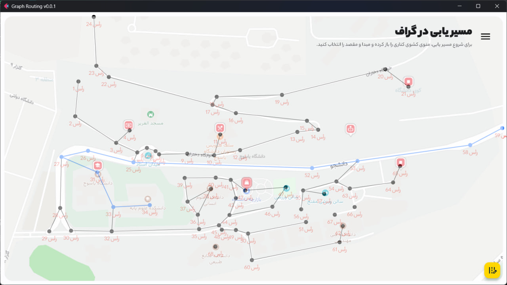

# Graph Routing App



Welcome to the Graph Routing App! This application allows you to visualize and navigate graphs, finding the shortest
route between two points.

## Installation

To get started, follow these simple steps:

1. **Clone the Repository:**

   run this command in your terminal for cloning the repository:
   ```shell
     $ git clone https://github.com/naderidev/graph-routing.git
     ```

2. **Install Requirements:**
    - If you prefer to run the app from the source code, start by installing the necessary Python packages. You can do
      this by executing the following command in your terminal:

      ```shell
      $ pip install -r requirements.txt
      ```

3. **Launch the App:**
    - Once the requirements are installed, run the `app.py` file using the following command:

      ```shell
      $ flet run app.py
      ```

## Routing Algorithm

Currently, the app employs one routing algorithm to find the shortest route between two points. Here's how it works:

- **Algorithm Overview:**

    1. **Graph Representation:**
        - The app converts the graphical points and lines into a structured dictionary that represents the relationships
          between points.
        - For instance, consider the following representation:

          ```python
          road = {0: [1, 2, 3], 1: [3, 2], 2: [1, 0], 3: [1, 0]}
          ```

    2. **Finding the Route:**
        - To find the shortest route between two points (e.g., from point **3** to point **2**), the algorithm traverses
          through the dictionary.
        - Starting from the origin point, it checks each list of connected points (neighborhood) for the destination
          point.
        - If the destination point is not found in the current list, it moves to the next list until the destination is
          located.
        - The algorithm then returns a list containing the sequence of points traversed to reach the destination.
        - For example, in the given representation, the route from point **3** to point **2** would be: `[3, 1, 2]`.

    3. **Visualization:**
        - Once the route is determined, the app visualizes the points and lines along the path, making it easy for users
          to navigate.

With this algorithm, the Graph Routing App efficiently finds the shortest path in a graph, providing users with a
seamless navigation experience.